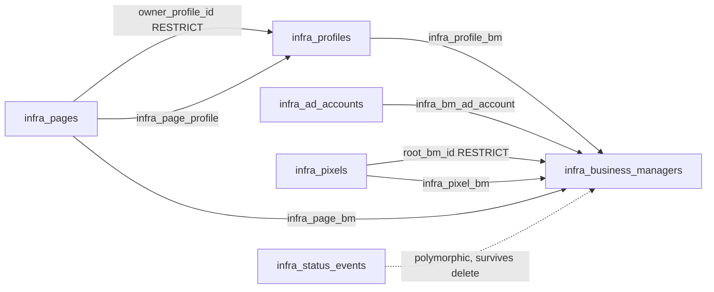

# Infrastructure monitor — design

**Date:** 2026-08-13
**Status:** design awaiting review; nothing built
**Branch:** `feat/infra-monitor`

## Problem

DOT runs its media buying through a rented supply chain: 175 ad accounts reached through Business
Managers that are administered by Facebook personal profiles, with pixels and pages shared across
them. Nothing in MetaConsole records that structure. The app knows an ad account exists and whether
it can spend; it does not know which BM reaches it, which profile administers that BM, or whether a
single ban would cut off access entirely.

The measured state of the book makes the gap concrete. Queried 2026-08-13 against production:

| Fact | Value |
| --- | --- |
| Ad accounts | 175 — 77 active, 84 `DISABLED` with `disable_reason = 1` (policy), 9 pending closure, 4 closed |
| Accounts exposing their owning BM | **14 of 175**, across 3 distinct businesses |
| Pixels in `meta_objects` | 56 across 34 accounts, 48 carrying `last_fired_time` |
| Pages, domains, profiles, BM inventory, payment methods | **absent entirely** |
| Historical account status changes | 77 `ad_account_update_status` + 61 `ad_account_add_user_to_role` in `meta_activities`, with actor names |

Nearly half the book is already disabled for policy reasons, and the app cannot say what access was
lost with each one.

## Why this is not Track G

Roadmap Track G ("WatchTower reconciliation") is **dropped as a boundary violation**, and that stands.
That track proposed reading PetalPixel's WatchTower data on the Hetzner box and reconciling it against
DOT's. This design does something categorically different: it builds the capability natively inside
MetaConsole, on DOT's own droplet, in DOT's own Postgres.

No read, no write, no sync, no shared credential, and no network path touches Hetzner, Firebase, or
any PetalPixel project. No records are copied from WatchTower; the registry starts empty and is
populated by hand. WatchTower informed the *functional* requirements only — the same way a competitor's
product would.

## The permission ceiling — measured, not assumed

The design hinges on what Meta will tell us, so it was probed against the live system-user token
(2026-08-13, `v25.0`, token valid). Granted scopes:

```
pages_show_list · ads_read · pages_read_engagement · pages_manage_ads · public_profile
```

`business_management` is **not** granted. Every business-level edge fails:

```
FAIL me/businesses            (#100) Missing Permission
FAIL biz/owned_ad_accounts    (#100) Requires business_management permission to manage the object
FAIL biz/client_ad_accounts   (#100) Requires business_management permission to manage the object
FAIL biz/owned_pages          (#200) Requires business_management permission to manage the object
FAIL biz/client_pages         (#200) Requires business_management permission to manage the object
FAIL biz/adspixels            (#200) Requires business_management permission to manage the object
FAIL biz/owned_domains        (#200) Requires business_management permission to manage the object
FAIL biz/business_users       (#200) Requires business_management permission to manage the object
FAIL biz/system_users         (#200) Requires business_management permission to manage the object
FAIL acct/assigned_users      (#100) For field 'assigned_users': The parameter business is required

OK   me/accounts (pages)      0 rows   — the system user administers no page
OK   act_*/promote_pages      0 rows   — page links are not exposed either
OK   act_*/adspixels          works    — this is how the 56 pixels already sync
OK   act_* node fields        funding_source_details, spend_cap, account_status, disable_reason, is_prepay_account
```

**Consequence:** the BM / profile / page / access-path graph cannot be synced from Meta at all. It is
operator-maintained by necessity, not preference. Granting `business_management` and re-minting the
token would expose DOT's own BM (`1986734115143944`) but still nothing for provider BMs such as
Amber Media, and nothing for personal profiles in any case — personal-profile admin access is not a
Graph concept. That option was offered and **declined**; the token is left untouched.

## Decisions

| # | Decision | Rationale |
| --- | --- | --- |
| 1 | The registry is entirely operator-owned. **No sync job writes any `infra_` table, ever.** | Removes the whole class of "a sync silently overwrote what I typed" failures, and keeps the feature independent of the Meta token, which the permission ceiling makes unavoidable for most of the graph anyway |
| 2 | Ad-account **status is never typed by hand** — it is `LEFT JOIN`ed read-only from `accounts` | The DB already holds correct, hourly ban state for all 175 accounts. A hand-typed status would contradict the live value on the same screen and be stale within a day |
| 3 | Real foreign keys with `CASCADE` on membership and `RESTRICT` on required owners | Referential integrity is the single highest-value fix over the reference implementation; it deletes an entire UI genre (see "What integrity buys") |
| 4 | Status changes record **old → new, with the acting user** | The reference implementation logs changed field *names* and hardcodes every actor as `"Admin"`, which is the exact spreadsheet failure it was built to replace |
| 5 | One shared risk selector, computed server-side | The reference implementation computes BM risk two different ways and its dashboard and risk map disagree |
| 6 | Flat access list; no "primary BM" concept | Decided by the operator. Ban impact is therefore phrased as paths lost, never as accounts needing re-pointing |
| 7 | Admin + superadmin only, gated in the loader **and** every server fn | Ban state and the rented supply chain are operations-sensitive; hiding nav is not security |
| 8 | No secrets of any kind | Keeps this app off the list of things worth breaching for credentials. Non-secret operational metadata (antidetect browser, proxy provider, geo) is still tracked |

## Data model

Eleven new tables — five entities, five link tables and one history table — all `infra_` prefixed, in
`src/db/schema.ts` alongside everything else.



### Entities

`infra_profiles` — a Facebook personal profile used to administer BMs.

| Column | Type | Notes |
| --- | --- | --- |
| `id` | text PK | `crypto.randomUUID()` at the insert site, per codebase convention |
| `name` | text not null | |
| `status` | text not null | `ProfileStatus`, default `new` |
| `geo` | text | free text; the reference implementation's unvalidated field is fine here |
| `browser` | text | antidetect tool in use (GoLogin / Multilogin / AdsPower / other). Non-secret |
| `proxy_provider` | text | provider name only. **No address, no credentials** |
| `notes` | text | |
| `created_at` `updated_at` `status_changed_at` | timestamptz | `status_changed_at` is what makes "how long suspended" answerable |

`infra_business_managers`

| Column | Type | Notes |
| --- | --- | --- |
| `id` | text PK | `randomUUID()` |
| `bm_id` | text not null **unique** | Meta BM id. Unique because two rows for one BM silently split its access graph |
| `name` | text not null | |
| `status` | text not null | `BmStatus`, default `active` |
| `verified_at` | timestamptz | human attestation; see "Verification" |
| `notes` | text | |
| `created_at` `updated_at` `status_changed_at` | timestamptz | |

`infra_ad_accounts` — operator-owned facts *only*; everything Meta knows is joined at read time.

| Column | Type | Notes |
| --- | --- | --- |
| `id` | text PK | The natural key `act_<digits>`, format-checked in the server fn |
| `label` | text | optional operator alias; the raw name comes from `accounts` |
| `usage_state` | text not null | `in_use` \| `spare` \| `retired`, default `in_use`. Not a Meta concept. Named `usage_state` rather than `usage` to stay clear of the SQL `USAGE` keyword |
| `notes` | text | |
| `created_at` `updated_at` | timestamptz | |

**No foreign key to `accounts`**, and this is deliberate for the reason the schema already documents on
`campaignClientOverrides`: a registry row may exist before the account appears in sync, or outlive its
departure from the book. The join is a `LEFT JOIN`; an unmatched row renders a "not in sync" badge
rather than disappearing. There is no `status` column — decision 2.

`infra_pixels`

| Column | Type | Notes |
| --- | --- | --- |
| `id` | text PK | the Meta pixel id (natural key, matching `meta_objects.id` for `object_type = 'pixel'`) |
| `name` | text not null | |
| `root_bm_id` | text not null → `infra_business_managers.id` **RESTRICT** | The reference implementation enforces "root must resolve" in a dialog; a constraint cannot be bypassed |
| `status` | text not null | `PixelStatus`, default `active` |
| `verified_at` | timestamptz | |
| `notes` | text | |
| `created_at` `updated_at` `status_changed_at` | timestamptz | |

`infra_pages`

| Column | Type | Notes |
| --- | --- | --- |
| `id` | text PK | `randomUUID()` — the Meta page id is optional, so it cannot be the key |
| `page_id` | text | optional |
| `page_url` | text not null | |
| `name` | text not null | |
| `owner_profile_id` | text not null → `infra_profiles.id` **RESTRICT** | |
| `status` | text not null | `PageStatus`, default `active` |
| `verified_at` | timestamptz | The reference implementation has verification on 2 of 5 entities; this fixes the asymmetry |
| `notes` | text | |
| `created_at` `updated_at` `status_changed_at` | timestamptz | |

### Link tables

All membership links are real join tables with composite primary keys and `ON DELETE CASCADE` both
ways. This is the structural departure from the reference implementation, which stores document-id
arrays on the dependent record.

| Table | Columns |
| --- | --- |
| `infra_profile_bm` | `profile_id` → profiles, `bm_id` → BMs, `created_at`. PK both |
| `infra_bm_ad_account` | `bm_id` → BMs, `ad_account_id` → ad accounts, `created_at`. PK both |
| `infra_pixel_bm` | `pixel_id` → pixels, `bm_id` → BMs, `created_at`. PK both — *shares only; the root lives on the pixel row* |
| `infra_page_bm` | `page_id` → pages, `bm_id` → BMs, `created_at`. PK both |
| `infra_page_profile` | `page_id` → pages, `profile_id` → profiles, `created_at`. PK both — *additional access only; the owner lives on the page row* |

Two invariants the reference implementation enforces at four separate layers, enforced here once each
in the server fn: a pixel's root BM is never also a share; a page's owner is never also an additional
profile. Belt-and-braces enforcement at form `onChange`, form save, insert, and inside a transaction
is what four layers bought, and it still lost pre-existing dangling ids on every save.

### Status history

`infra_status_events`

| Column | Type | Notes |
| --- | --- | --- |
| `id` | text PK | `randomUUID()` |
| `kind` | text not null | `profile` \| `bm` \| `ad_account` \| `pixel` \| `page` |
| `entity_id` | text not null | plain text, **no FK** — history must survive the entity's deletion |
| `event` | text not null | `status_change` \| `verify` |
| `from_status` `to_status` | text | null for `verify` events |
| `reason` | text | captured on transitions into `suspended`, `restricted` and `banned` |
| `actor_email` | text not null | the real session user, following `auditLog.actorEmail` precedent |
| `at` | timestamptz not null default now | |

Index on `(kind, entity_id, at)`. This table is what makes verification a *history* instead of a
timestamp that each attestation overwrites, and what makes "how many suspensions this quarter" a query
rather than an unanswerable question.

### Status vocabularies

One module, `src/lib/infra-status.ts`, in the established shape — `as const` tuples plus type guards,
mirroring `src/lib/delivery-status.ts`. **No `pgEnum`**: with push-only migrations an enum change
becomes a manual `ALTER TYPE`, and the schema's existing convention is `text` + comment + TS union +
runtime guard.

| Entity | Values |
| --- | --- |
| Profile | `new` `active` `in_review` `suspended` `banned` `retired` |
| BM | `pending_verification` `active` `in_review` `restricted` `banned` |
| Pixel | `active` `inactive` `restricted` |
| Page | `active` `in_review` `restricted` `banned` `unpublished` |
| Ad account | none — read-only from `accounts` |

Per-entity vocabularies rather than one shared enum, because the words differ in kind: Facebook
*suspends* profiles and *restricts* BMs, and a pixel is never banned. **Every value must participate in
at least one rule** — the reference implementation ships `Pixel.inactive` and `Page.in_review` that
appear in no risk calculation, no alert and no dashboard count, which is worse than not having them.
The risk model below is written to honour that: each vocabulary is fully covered, and
`src/lib/infra-status.test.ts` asserts it by iterating every value of every vocabulary and requiring
the risk function to return a non-default classification reason for it.

## What integrity buys

Under array-based links with no constraints, the reference implementation needs all of this, and none
of it will exist here: `"Missing BM: <id>"`, `"Missing root BM: <id>"`, `"Missing owner: <id>"`,
`"Missing profile: <id>"`, `"Unknown BM"`, `"Unknown profile"`, `"No active owner"`,
`"Orphaned BM link"`, `"Orphaned access"`, per-write `knownBmIds` / `knownProfileIds` filtering,
dangling-id search matching so orphans stay findable, and a bespoke optimistic-update protocol with a
monotonic draft counter and a failed-version set to roll back link writes.

Worth stating plainly because it is the main reason to rebuild rather than port: that filtering is
*self-healing and data-losing at the same time* — saving a record with pre-existing dangling ids drops
them silently.

The cost is that deleting a profile that owns a page, or a BM that roots a pixel, is refused. That is
the correct behaviour, and the error message names the blocking dependents.

## Risk model

`src/lib/infra-risk.ts` — pure, no I/O, unit-tested. The redundancy rule is the product thesis: every
asset needs at least two independent access paths so one ban cannot lock you out.

```
redundancy(0) → critical  "No backup"
redundancy(1) → warning   "Single access"
redundancy(n ≥ 2) → safe  "Redundant"
```

Two usability predicates, applied consistently:

- `usableProfile(status)` = `active` or `new`. Everything else — `in_review`, `suspended`, `banned`,
  `retired` — provides no access, so a BM with three suspended profiles correctly reads critical.
- `usableBm(status)` = `active` or `pending_verification`. `in_review`, `restricted` and `banned` are
  excluded on the same standard as profiles: a BM you cannot rely on is not a backup path. A BM awaiting
  verification still works, which is why it counts.

Then, per entity:

- **BM** risk = `redundancy(admin profiles passing usableProfile)`.
- **Ad account** risk = `redundancy(linked BMs passing usableBm)`. The reference implementation counts
  raw links, so an account reachable only through a banned BM scores *safe* — the same mistake it fixes
  for profiles and misses for accounts. Accounts with `usage_state = retired` are excluded from the risk
  map entirely: a retired account with no access path is not a problem to solve. `spare` accounts are
  included, because a spare you cannot reach is not a spare.
- **Pixel**, first match wins: root BM fails `usableBm` → `critical "Root BM unusable"`;
  `status = restricted` → `warning "Restricted"`; `status = inactive` → `warning "Inactive"`; zero
  shares → `warning "Not shared"`; else `safe "Shared"`.
- **Page**, first match wins: owner profile fails `usableProfile` → `critical "No active owner"`;
  `status = banned` → `critical "Banned"`; `status = restricted` → `warning "Restricted"`;
  `status = in_review` → `warning "In review"`; `status = unpublished` → `warning "Unpublished"`; no
  linked BMs and no additional profiles → `warning "No added access"`; else `safe "Added"`.

Profile and BM rows carry their own status as well as their redundancy risk, so a `banned` profile is
visible as such even though its own risk is about the pages it owns rather than about itself.

Computed **server-side, once**, in the fn that builds the risk map, so the dashboard counts and the
risk map cannot diverge. The reference implementation's dangling-link override, which lives in two
screens rather than in its risk module, has no analogue here: foreign keys make the condition
unreachable.

## Routes and UI

A third `<SidebarGroup>` labelled **Infrastructure** in `AppSidebar.tsx`, admin-gated in the same
computed-array style as `systemItems`. Flat dot-named route files, matching all 20 existing routes
(the `README.md` directory form is documented but used nowhere).

| Route | Contents |
| --- | --- |
| `infrastructure.index.tsx` | Entity counts, then the **risk map** — BMs, ad accounts, pixels, pages, each sorted critical → warning → safe, with an all-clear state. The differentiating screen |
| `infrastructure.profiles.tsx` | List, search, status filter, create/edit dialog, BM link editor |
| `infrastructure.business-managers.tsx` | List, `bm_id` with copy button, verify action, profile and account link editors |
| `infrastructure.business-managers.$id.tsx` | Access chain plus this BM's status history |
| `infrastructure.ad-accounts.tsx` | Registry fields **plus live joined status**, `disableReasonLabel()`, spend cap, balance |
| `infrastructure.pixels.tsx` | List, root BM, shares, verify |
| `infrastructure.pages.tsx` | List, owner, linked BMs, additional profiles, verify |

Conventions followed without deviation, because the point is that this looks native: `createFileRoute`
with `head` → `loader` → `component` → `pendingComponent`; loaders call server fns directly, no
react-query; `PageHeader` with `max-w-[1600px]`; hand-rolled `<table>` markup in the established shape
(no data-grid library exists here, and `ui/table.tsx` is imported by nothing); `useSort` + `SortHeader`
from `SortableTable`, the newer of the two sort conventions; `StatusPill` with its `styles`/`dots` maps
extended rather than a new pill; filters in local `useState`, not URL state; mutations call the POST fn
then `router.invalidate()`; feedback via inline `useState` messages and `window.confirm` — `<Toaster />`
is mounted nowhere and this feature will not be the first to introduce toasts.

**Ported deliberately:** multi-hop search. A query matches a record's own fields *or* any linked
entity's display name or external id, so searching a BM name surfaces the pixels, pages and accounts
hanging off it. Cheap, and the single most useful interaction in the reference implementation.

## Server layer

Two files, following the mandatory split: `src/lib/api/infrastructure.ts` holds thin `createServerFn`
wrappers with identity-typed `.inputValidator((d: {…}) => d)` (not zod — zod appears in exactly one
untouched scaffold file); `src/server/fns/infrastructure.ts` holds the implementation.

Every fn calls `requireAdmin()`. Every route loader additionally does
`if (!isAdmin(me?.role)) throw redirect({ to: "/" })`. Both, because the loader stops the page
rendering and the fn stops the RPC endpoint being called directly.

Writes follow the canonical four-step shape from `setStatusOverride`: gate, validate, mutate, `audit()`.
Audit actions are dotted, matching `user.approve` / `client.account.add`: `infra.profile.create`,
`infra.bm.status`, `infra.pixel.link`, and so on. A status change writes **both** an `audit_log` row
and an `infra_status_events` row — the former is the cross-app admin trail, the latter is the
queryable per-asset history.

Reads: one `getInfraRiskMap()` for the index (five entity selects plus five link selects, risk computed
server-side), and one focused fn per list page. Total data volume is a few hundred rows, so no
pagination in v1; a note in the code says what to do if the registry grows past a few thousand.

## Verification

Attestation is kept, because the domain genuinely needs "someone confirmed all 20 accounts are still
visible from this BM" and no API can answer it. Two changes from the reference implementation:

1. Available on **BM, pixel and page** — it has it on BM and pixel only.
2. Each attestation **inserts an `infra_status_events` row** (`event = 'verify'`) instead of
   overwriting a single timestamp, so verification has a history.

Overdue threshold is a named constant, `VERIFICATION_OVERDUE_DAYS = 30`, exported from
`src/lib/infra-risk.ts`. **No settings page.** The reference implementation's settings screen ships
three thresholds and three notification channels, of which one threshold is read by nothing, one
channel set is labelled "UI only — no actual sending", and the export button is a stub. Live config for
absent features is worse than no config.

## Failure modes

| Failure | Handling |
| --- | --- |
| Deleting a profile that owns a page, or a BM that roots a pixel | Refused by `RESTRICT`; the error names the blocking dependents. Deliberate |
| Registry row for an ad account absent from `accounts` | `LEFT JOIN` yields nulls; row renders with a "not in sync" badge |
| Two registry rows for one Meta BM | Prevented by the unique constraint on `bm_id` |
| Malformed ad-account id | Format-checked against `act_<digits>` in the server fn before insert |
| Registry drifts from reality (a BM was banned and nobody typed it) | **Accepted and unmitigated.** This is the inherent cost of the manual model, and the reason it was offered as a tradeoff. Ad-account status is exempt: it is synced |
| Two operators editing the same links | Last write wins; links are individual rows so concurrent edits to *different* links do not collide |
| `status_changed_at` vs `infra_status_events` disagreeing | Both written in the same server fn; the column is a denormalised convenience for sorting, the table is the record |

## Out of scope, deliberately

No sync job and no `infra_` table written by machine · no Meta token or scope change · no
`business_management` · no credentials, passwords, 2FA seeds or proxy addresses · no alert rows and no
Telegram delivery (risk map is in-app only) · no client or spend linkage — infrastructure stays purely
operational · no primary-BM distinction · no CSV import or bulk actions · no domains, payment methods,
provider entities, apps, or Instagram/WhatsApp assets · no settings surface · no numeric health score ·
no pagination.

Each of these was either an explicit operator decision or follows from one. The nearest tempting
addition is a `provider` dimension on ad accounts — the supply chain is already legible in account
naming (DOT 136, Amber Media 29, CL 3) and would enable provider survival comparison. It is one column
and is left out because providers were not among the chosen v1 entities.

## Verification plan

- Unit tests beside source, per convention: `src/lib/infra-risk.test.ts` covering the redundancy
  boundaries (0, 1, 2), both usability predicates, and every ordered branch of the pixel and page
  precedence chains including the `usableBm`-only account rule and the `retired` exclusion;
  `src/lib/infra-status.test.ts` pinning each vocabulary and its guard, plus the **exhaustive coverage
  test** — iterate every value of every vocabulary and assert the risk model classifies it, so a status
  added later cannot silently become dead the way `Pixel.inactive` did in the reference implementation.
- DB-backed tests against `TEST_DATABASE_URL` for the parts only Postgres can prove: `CASCADE` removes
  membership rows, `RESTRICT` refuses an owner delete, `bm_id` uniqueness holds, and a status change
  writes exactly one `infra_status_events` row with the acting user and both old and new values.
- Schema pushed to the test database first and read back before production. Local `DATABASE_URL` points
  at production through the tunnel; the change is purely additive so `push` is safe, but proving it
  twice costs nothing.
- `bunx tsc --noEmit` and `bun run lint` clean.
- Browser smoke test on the branch, exercising the path the feature exists for: create two profiles and
  a BM, link one profile, confirm the BM reads `warning "Single access"`, link the second, confirm
  `safe "Redundant"`, ban one profile, confirm it drops back to warning, then ban the BM and confirm
  its ad accounts lose a path on the risk map. Screens are verified against the live page, not inferred
  from passing unit tests.

---

*Measurements were taken 2026-08-13 against production Postgres through the SSH tunnel and against the
live Graph token. The Graph permission findings are the load-bearing ones; the row counts are a
snapshot. Symbol names, not counts, are the reliable anchor.*
