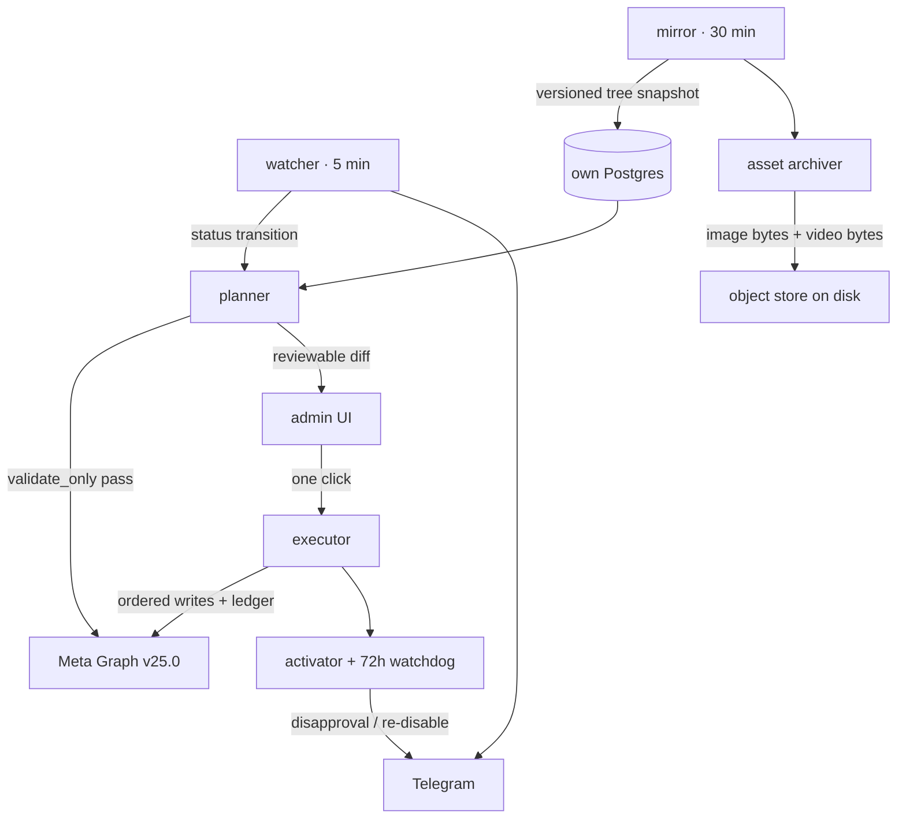

# Campaign migrator — design

**Date:** 2026-08-19
**Status:** design awaiting review; nothing built
**Shape:** standalone app, its own host, its own Meta app and token
**Working name:** Lifeboat

## Problem

When an ad account is disabled, the campaigns on it stop earning and the setup that produced them —
structure, budgets, targeting, creatives, copy, tracking — exists only inside an account nobody can
write to any more. Recovery today is a media buyer rebuilding it by hand in a spare account, which is
day 3 of `docs/campaign-launch-process.md` compressed into an emergency and re-typed from memory.

Measured against DOT production on 2026-08-19:

| Fact | Value |
| --- | --- |
| Ad accounts | 203 — 103 active (`status 1`), 87 disabled (`status 2`), 13 closed (`status 101`) |
| Accounts that spent in the last 7 days | **12** — and **3 of those 12 are already disabled** |
| A typical spending account's tree | ~2 campaigns · ~6 ad sets · ~25 ads (worst observed: 108 ads) |
| Ads by effective status | 2,452 ACTIVE · 1,835 DISAPPROVED · 1,819 CAMPAIGN_PAUSED · 1,454 WITH_ISSUES |
| Creative specs mirrored | 25,803 of 25,805 creatives carry `object_story_spec`; 0 ACTIVE ads have a missing creative row |
| Distinct video ids referenced by creative specs | **2,321** |
| Live Marketing API access tier | **`development_access`** (from `token_health.tier`) |

A quarter of the currently-earning book is already sitting in the failure state this feature exists to
answer. The migration unit is small — tens of ads, not thousands — which is what makes full automation
tractable.

## What this is not

It is not an integration with PetalPixel's Meta Ads Uploader, fbtools, or anything on the Hetzner box.
Per roadmap §0 (lines 31–36), *building a capability natively is not the same as integrating*: this is
DOT's own publishing leg, on DOT's own host, with DOT's own Meta app and token, and no network path to
Hetzner, Firebase, or any PetalPixel project.

It is also not roadmap idea 20, which was rejected for "writes against live ad accounts with no undo,
on top of a deliberately fuzzy `resolveClient()`". This design answers both halves of that objection
directly: there is no fuzzy client resolution anywhere in it (the operator names the source and the
destination account explicitly, joined on `act_<digits>`), and undo exists — see
[Rollback](#rollback-is-real-here).

## The five facts the API forces on the design

Verified against the v25.0/v26.0 Marketing API reference and both official SDKs.

1. **There is no cross-account copy.** `POST /{campaign_id}/copies`, `/{adset_id}/copies` and
   `/{ad_id}/copies` have no destination-account parameter. `adset_id`/`campaign_id` on those edges
   re-parent within the same account. The feature must be *read the source tree, transform, re-create*
   — never a copy call.
2. **Images transfer by hash; videos do not.** `POST /act_{DEST}/adimages` accepts
   `copy_from={"source_account_id","hash"}`, which moves an image across accounts with no byte
   transfer. `POST /act_{DEST}/advideos` has no equivalent — every video must be re-uploaded from
   bytes we hold. Facebook CDN URLs are explicitly forbidden as upload inputs
   (`AdImage.url`: "Do not use this URL in ad creative creation"; `file_url` from FB CDN fails with
   error 389).
3. **Video bytes are not reliably retrievable from Meta.** `source` on the video node is documented but
   the page is banner-flagged as removed after v3.2, and the documented token types (public-privacy
   Page/User token, or `user_videos`) do not cover ads-library videos read by a BM system user. It
   works in practice today; nothing obliges it to keep working. **Therefore the archive must be
   continuous and pre-emptive, not lazy.** This is the single largest architectural consequence.
4. **Assets are shared, never copied — and sharing is BM-scoped.** A custom audience can be shared
   (`POST /{audience_id}/ad_accounts`) but never duplicated, and a shared audience "cannot be modified
   or used as a seed audience to create lookalikes". Pixel sharing across a BM boundary needs
   `POST /{pixel_id}/agencies` before `shared_accounts` (September 2024 change). Pages need
   `POST /{business_id}/client_pages`. All of that needs `business_management` and, for pixels, the
   upgraded access tier.
5. **There is no idempotency key.** Nothing in the Marketing API dedupes a creation call, and no SDK
   exposes one. A timed-out POST may have succeeded. What does exist:
   `execution_options=['validate_only']` (runs every validation rule and creates nothing) and
   `synchronous_ad_review`. The design leans on both.

Lead forms, click-to-WhatsApp configuration and the Page itself are **Page-scoped**, so reusing the
same Page carries them across an ad-account change for free — no re-creation, no new form id, no lost
leads.

## Decisions taken

| Decision | Choice | Why |
| --- | --- | --- |
| Home | Standalone app, own host | A write-scoped token never touches MetaConsole's read-only analytics; a Meta app ban or write throttle on the migrator cannot degrade reporting or the hourly sync. |
| Meta app | New, dedicated, read + write | Isolates the blast radius and gives writes their own rate-limit budget. Cost: a new app starts on the limited tier with no call history. |
| Autonomy | Auto-prepare → one-click publish → everything lands PAUSED → second click activates | The `validate_only` dry run plus a paused landing plus a ledger-backed teardown is what makes automated writes defensible. |
| Destination | Spare account in the same BM first; cross-BM as an explicit fallback | Same-BM needs no asset sharing at all. Cross-BM is the only answer to a BM-level ban, and is gated behind a flag because it needs `business_management` and partnership setup. |
| Creative policy | Migrate verbatim, flag afterwards | Operator's call, recorded with its risk: see [Accepted risk](#accepted-risk-creative-propagation). |
| Scope | The delivering tree only; reuse the same pixel and Page | Keeps tracking, lead forms and CTWA working untouched, and needs no change on the client's site. |

## Architecture

Five processes and one UI, all on the migrator's own host, against the migrator's own Postgres.

### watcher — 5 minute poll

For each managed account: `GET act_X?fields=account_status,disable_reason,spend_cap,amount_spent,balance`.
One call per account; 100 accounts is 100 reads per 5 minutes, trivial even on the limited tier.
Writes an append-only `account_status_log` at **minute precision**, which is strictly better than
MetaConsole's day-precision `disabledSinceMap()` inference from `meta_activities`.

Two rules learned from MetaConsole's implementation:

- **A failed read is not health.** MetaConsole's `accountStatus()` maps `!raw → ACTIVE`, and
  `cycle.ts` falls back to DB ids when enumeration is rate-limited — so a throttle reads as healthy.
  The watcher must treat an unreadable account as `unknown` and alert, never as active.
- **A simultaneous flip across every account in one BM is a BM-level event**, not N account events.
  It must raise one escalation and route to the cross-BM plan, because no spare inside that BM can help.

### mirror — 30 minute snapshot

Walks only the *delivering tree* of managed accounts: non-archived campaigns → ad sets → ads →
creatives. Stores the full Graph node per object plus an append-only, versioned snapshot, so a
migration always rebuilds from **the last snapshot taken while the account was healthy** rather than
from whatever the account looks like after it died.

Fields that must be captured because they are required on write and easy to lose:
`special_ad_categories` (required on every campaign creation worldwide — send `[]` when none),
`special_ad_category_country`, `promoted_object`, `targeting`, `attribution_spec`, `bid_strategy`,
`billing_event`, `optimization_goal`, `destination_type`, `url_tags`, `tracking_specs`,
`conversion_specs`, `degrees_of_freedom_spec`, plus the source account's `default_dsa_payor` /
`default_dsa_beneficiary` (ad sets targeting the EU reject creation without `dsa_payor` /
`dsa_beneficiary`, error 100 subcodes 3858079 / 3858081, and passing only the payor silently fills
the beneficiary from the account default).

### asset archiver — continuous, queue-driven

For every asset referenced by a mirrored creative:

- **Images** — record `hash` + owning account so `copy_from` can be used at publish time, *and* archive
  the bytes as insurance, because `copy_from` requires read access to the source account and a closed
  account may not grant it.
- **Videos** — download the bytes and the thumbnail, deduplicate by SHA-256, store on disk. Every
  failure is recorded per video and surfaced.

**Archive coverage is the feature's real promise.** An unarchived video is an unrecoverable ad, so the
UI leads with per-account coverage ("23 of 25 videos archived") rather than burying it. Sizing from
measured data: 2,321 distinct referenced videos across all history ≈ 7–19 GB at 3–8 MB each; scoped to
delivering trees only, roughly 300–600 videos ≈ 1.5–5 GB. Disk, not object storage, until it isn't.

### planner — builds a reviewable, pre-validated plan

1. Load the last healthy tree snapshot.
2. Resolve the destination: a `spare` account, in the same BM, readable, funded, in good standing.
   Note error 3980 — one bad-standing account in a BM blocks *creating* new accounts in it, so the
   spare must pre-exist. This is an inventory discipline the app can enforce but not invent.
3. Build the asset map: source `image_hash` → destination hash via `copy_from`; source `video_id` →
   destination `video_id` via re-upload.
4. Transform each object: strip the read-only fields Meta rejects on write (`id`, `account_id`,
   `object_type`, `effective_object_story_id`, `effective_instagram_media_id`,
   `effective_authorization_category`, `thumbnail_id`, `link_og_id`, `instagram_permalink_url`,
   `source_facebook_post_id`, `status`), re-point account-scoped ids, force `status=PAUSED`, carry DSA
   and special-ad-category fields, keep the same `page_id` and `promoted_object.pixel_id`.
5. Run `execution_options=['validate_only']` for every object in dependency order and attach the
   result. Nothing is created. This is the dry run that makes the one-click publish honest.
6. Emit a diff for review: what will be created, what validated clean, what will not, and which
   assets are missing from the archive.

### executor — ordered writes behind a ledger

Order is forced by dependency: images → videos → creatives → campaigns → ad sets → ads.

The ledger row is written **before** each POST, not after. On a timeout or 5xx the executor
**GETs and decides** rather than retrying, because a blind retry with no idempotency key produces a
duplicate. Two traps worth naming in code comments:

- Reusing an `object_story_id` already attached to a creative returns the **existing** `creative_id`
  instead of creating one — the ledger can end up pointing at a creative we did not make.
- `image_hash` and `image_file` are **silently ignored** when `object_story_spec` is set. A naive
  re-post that sets both loses the image with no error.

### Rollback is real here

Everything lands PAUSED and has therefore never spent. Undo is: walk the ledger and delete exactly
what we created, newest first. That is a genuine rollback, not a compensating guess — and it is the
substantive difference between this and the write-actions idea that was rejected.

### activator + watchdog

A second explicit click flips the tree to ACTIVE, optionally ramping daily budgets from a fraction of
the original. For 72 hours afterwards the watchdog polls the destination for `effective_status`
transitions to DISAPPROVED / WITH_ISSUES and for any change in `account_status`, and alerts to
Telegram. This watchdog *is* the "flag afterwards" half of the creative policy decision.

## Accepted risk: creative propagation

87 of 203 accounts are disabled, overwhelmingly `disable_reason = 1` (ads integrity policy). When the
creative is what triggered the ban, re-uploading it verbatim can lose the destination account too, and
repeated offences escalate to the Business Manager. The operator has chosen verbatim migration with
post-hoc flagging; recorded here so the tradeoff is deliberate rather than discovered. Mitigations
carried in the design: the 72-hour watchdog, and surfacing which source ads were already DISAPPROVED
before the account died (1,835 such ads exist today, so the app can point at the likely offenders
without blocking).

## Data model

| Table | Purpose |
| --- | --- |
| `managed_accounts` | `act_<digits>`, BM id, label, role (`source` / `spare` / `retired`), default page + pixel, watch flag |
| `account_status_log` | append-only status transitions at minute precision |
| `tree_snapshots` | append-only versioned snapshot of an account's delivering tree |
| `assets` | kind, source account, meta id or hash, sha256, path, archived_at, error |
| `migrations` | source, destination, reason code, state, created_by, approved_by |
| `migration_objects` | **the ledger** — level, source id, destination id, validate result, post result, error |
| `audit` | actor, action, detail — same shape as MetaConsole's `audit()` |

Migration state machine: `detected → planned → validated → awaiting_approval → publishing →
published_paused → awaiting_activation → active → watching → complete`, with `failed_partial` reachable
from `publishing` and resolvable by resume or teardown.

## What is reused, and how

Copied into the new repo as a starting point, not imported across a network boundary: `src/meta/`
(`client.ts`, `limiter.ts`, `rate-limit.ts`, `url.ts`, `proof.ts`, `fake-client.ts`) already solves
`appsecret_proof`, cursor pagination, BUC header parsing, tier-adaptive pacing, retry classification
and field-error bisection. It gains write methods, `validate_only`, a **separate** pacing budget for the
`ads_management` bucket, and the write-side error taxonomy (80004/2446079 account throttle, 613, 368,
3858152 DSA, 1404163 entity ad ban, 3979/3980 account creation).

Auth (`password.ts`, `session.ts`, `roles.ts`, `gate.ts`), the `audit()` pattern, `crypto.ts` for the
token at rest, and the Telegram alert sender port over directly. There is **no** database link, no
shared token and no cross-app call: the two apps stay independent.

## Testing

Unit tests against a fake client for every transform (field stripping, DSA carry-over,
`special_ad_categories` always present, asset remap, PAUSED forcing, read-only field rejection).
End-to-end runs against a throwaway ad account in the destination BM, publishing paused trees for
real and tearing them down by ledger.

Cases that must be exercised because each has already been shown to behave surprisingly: video whose
`source` is unavailable; video large enough to need chunked upload; image over 8 MB; carousel with
video children; dynamic creative `asset_feed_spec`; catalog `product_set_id`; lead-gen
(`lead_gen_form_id` unchanged across the account move); CTWA (`destination_type=WHATSAPP`); an
EU-targeted ad set with and without DSA fields; an `object_story_id` already in use; a deliberate
80004 throttle with resume; an executor killed mid-publish followed by a resume that creates no
duplicates; a rate-limited watcher read that must read as `unknown` and not as ACTIVE; a simultaneous
BM-wide flip; and the cross-BM path end to end (pixel `/agencies` → `shared_accounts`, Page
`client_pages`, and the shared-audience lookalike refusal).

Roles: admin publishes, member views only. Surfaces: desktop Chrome and Safari, plus mobile web for
the approve and activate buttons — the person approving a migration at 02:00 will be on a phone.

## Sequencing

Phase 0 is Meta-side and gates throughput, so it starts first and runs in parallel with everything:
create the app, verify the business, create and install the system user, assign accounts with the
`MANAGE` task, mint a token with `ads_management` + `business_management`, then pursue the upgraded
access tier. A new app begins on the limited tier: 60 points per 300 s with writes costing 3 points is
**~20 writes per 300 s**, so a typical ~90-call migration takes ~22 minutes of pure throttling and a
worst-case 108-ad account takes over an hour. The upgraded tier raises the ceiling roughly 150×.

Then: scaffold and deploy → write-capable Meta client → watcher → mirror → **archiver** → planner →
executor → UI → watchdog → hardening. The archiver is deliberately early and out of dependency order:
archive coverage only accrues with time, and every day without it is a day of creatives that cannot be
recovered.

## Open questions

- Which specific accounts are `managed` at launch, and which are designated spares? The 12
  currently-spending accounts are the obvious starting set, but the spare inventory is an operator
  judgement the app cannot infer.
- Host: a second small droplet, or a separate service and database on the existing one? "Own host"
  was the decision; the existing droplet has 108 GB free but only 3 GB RAM.
- Does the destination reuse the source account's *name* convention, and what lineage marker should
  land on migrated objects — a name suffix, an ad label, or ledger-only?
