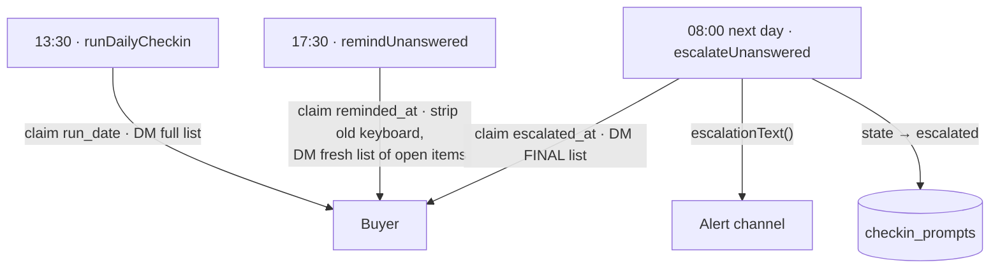

# Media-buyer check-in — three-stage notification timing

**Date:** 2026-08-19
**Status:** approved; implementation follows
**Branch:** `feat/checkin-notify-timing`, off `origin/feat/meta-integration` so it ships independently
of the infrastructure-monitor work.

## What changes

The check-in nags a media buyer **twice** today: a prompt at 17:00 Berlin and, next morning at 09:00,
a post to the shared alert channel that the buyer never sees. It becomes **three notifications, all
of which reach the buyer**:

| # | Berlin wall clock | Sent to | Condition |
| --- | --- | --- | --- |
| 1 | **13:30** | buyer DM | every in-scope campaign, as today |
| 2 | **17:30** | buyer DM | only campaigns still `pending` / `awaiting_reply` |
| 3 | **08:00 next prompt day** | buyer DM **and** the alert channel | still unanswered; marked FINAL |

Notification 3 keeps everything the current 09:00 escalation does — the channel post and the
`state → escalated` write — and gains the buyer DM in front of it.

## Timezone

"CET" means **Berlin wall clock**, confirmed with the operator. `Europe/Berlin` is CET in winter and
CEST in summer, so 13:30 is 13:30 as the buyer experiences it year-round (11:30 UTC in summer, 12:30
UTC in winter). This is the contract `berlin-time.ts` already documents and follows; no fixed-offset
arithmetic is introduced anywhere.

## Time model

`src/lib/berlin-time.ts` currently resolves only `{ date, hour }`, and every gate is
`local.hour >= CHECKIN_HOUR`. Half-past marks need minutes.

- `LocalNow` gains `minute: number`; `BERLIN_OPTIONS` gains `minute: "2-digit"`, parsed in the same
  loop and covered by the same throw-on-missing rule. That rule is load-bearing: this project does not
  enable `noUncheckedIndexedAccess`, so a dropped part yields `NaN`, and a `NaN` comparison is false
  forever — a check-in that never fires and never complains.
- New `atOrAfter(local, mark)` compares minute-of-day. It earns a name over three inlined
  comparisons because the three gates must stay in lockstep, and because an hour-only regression at
  any one call site is silent.

`hourCycle: "h23"` stays exactly as-is, for the reason already recorded there: an `h24` cycle renders
Berlin midnight as hour 24 with the date rolled forward, which would leave every gate true all night.

## Schedule constants

`src/lib/checkin.ts` — `CHECKIN_HOUR` and `ESCALATION_HOUR` are **deleted**, not deprecated. Clean
cutover; every caller migrates.

```ts
export const FIRST_PROMPT_AT = { hour: 13, minute: 30 } as const;
export const REMINDER_AT     = { hour: 17, minute: 30 } as const;
export const FINAL_NOTICE_AT = { hour:  8, minute:  0 } as const;
```

## Flow



## Schema

One column: `checkin_runs.reminded_at timestamptz null`. It is to notification 2 what `escalated_at`
is to notification 3 — the at-most-once claim.

Applied by executing the `ALTER` **directly** against both `meta` and `meta_test`. This repo has no
`src/db/migrations` directory, and `bun run db:push` is not safe unattended here: it proposes
destructive changes alongside additive ones. That constraint is already recorded in
`docs/superpowers/plans/2026-08-13-media-buyer-checkin.md`.

## Notification 2 — `remindUnanswered(now)`

New export in `src/sync/jobs/checkin.ts`, shaped on `escalateUnanswered`.

- Gated on `isPromptDay(today)` and `atOrAfter(local, REMINDER_AT)`.
- Claims `reminded_at` for `run_date = today` where it is null, via conditional update. **Claim before
  send**, deliberately: a crash after claiming loses one nudge, a crash before it re-runs cleanly. For
  an at-most-once notification that is the right way round, and it is the same trade `escalated_at`
  already makes.
- Per buyer holding prompts still `pending` / `awaiting_reply` today:
  1. `editMessageText` the existing list with an **empty keyboard**, so exactly one list in the chat
     is ever interactive.
  2. Send a fresh list containing **only the open items**.
  3. Repoint `list_message_id` for that buyer's whole day, so `rerenderList` — which keys on
     `chat_id + list_message_id` — follows the new message.
- `unroutable` prompts are skipped: there is no chat to send to. They remain notification 3's business,
  which names them in the channel post so a missing Telegram binding stays visible.

Step 1 also closes an existing defect rather than multiplying it. The known gap recorded at
`src/sync/jobs/checkin.ts:149-151` is that a re-sent list orphans the previous message's live keyboard,
which then never shows a checkmark. Stripping it is what makes re-sending safe.

## Notification 3 — `escalateUnanswered` gains the buyer DM

- Gate moves from `hour >= 9` to `atOrAfter(local, FINAL_NOTICE_AT)`.
- Same strip-and-resend as notification 2, with the FINAL notice as the list header.
- **Order is load-bearing: DM → channel post → `state → escalated`.** A failed DM records into `note`
  and must NOT abort the channel post; management visibility is the more important half. A failed
  channel post keeps its current behaviour — prompts stay in their open states, because closing them
  out for an escalation nobody received would take away the buyer's buttons AND tell no one.
- The existing backlog rule is preserved unchanged: escalate **every** unescalated day before today,
  oldest first. That is what makes the weekend correct without any weekend-specific code — Friday's
  prompts run Fri 13:30 → Fri 17:30 → **Mon 08:00**, and nobody is nagged on Saturday.
- The `UNANSWERED_AT_ESCALATION` state predicate on the final write stays. It is a blind write by stale
  id across a network send; forcing an answer that landed in that window back to `escalated` would
  hide it from the flush forever, because nothing rescans `escalated` rows.

## Rendering

`src/lib/checkin-render.ts` — `renderList` takes an optional notice, so the three sends differ only in
their header and share one code path for numbering, markers and buttons:

| Stage | Header |
| --- | --- |
| 1 | `🕔 Daily check-in — Thu 13 Aug` (unchanged) |
| 2 | `⏰ Reminder — still open` |
| 3 | `🚨 FINAL notice — this is the last reminder` |

The module stays pure, which is what keeps all three variants unit-testable with no clock and no
network.

## Copy that must follow, or it lies to operators

| Location | Today | Becomes |
| --- | --- | --- |
| `src/sync/worker.ts:57` | `"17:00 prompt, 09:00 escalation, 30s poll"` | the three marks |
| `src/sync/worker.ts` gates | three `local.hour >= …` | `atOrAfter(local, …)`, plus the new reminder gate |
| `MediaBuyerPanel.tsx:298-302` | "the job runs at 17:00 Berlin", compares `data.today.hour` | 13:30, compared on minutes |
| `src/server/fns/checkin.ts:55-62` | `today: { date, hour, … }` | gains `minute`; doc comment stops saying "the 17:00 job" |

## Testing

Pure unit tests only. `meta_test` is a shared mutable database, not a private fixture — this area's
convention forbids DB-backed tests, and that predates this change.

- `berlin-time.test.ts` — minute extraction; the 13:29 / 13:30 boundary; both DST sides; the existing
  hostile-`process.env.TZ` probe still passing (it only bites because the formatter is built per call).
- `checkin.test.ts` — the three marks are the agreed values; `atOrAfter` boundaries including 17:29
  shut / 17:30 open, and midnight.
- `checkin-render.test.ts` — each header variant, and that stage 3 is identifiably final.

**Smoke test, not a substitute for one:** run the real worker loop against `meta_test` with a stubbed
Telegram client and the clock frozen at each of 13:30, 17:30 and 08:00, asserting exactly one send per
stage, that the second and third carry only open items, and that a second pass at the same mark sends
nothing (the claims hold).

## Deployment note

The check-in worker is the long-lived `meta-sync` service on the droplet. A timing change takes effect
only when that service restarts, which the deploy runbook already does. Nothing here is picked up by a
`meta-web` restart alone.

## Rejected alternative

A generic N-stage nag table (`checkin_nudges` rows carrying due-offsets) instead of three named marks.
More flexible, buys nothing that was asked for, and trades two auditable claim columns for a scheduler
to debug. Three marks match how the surrounding code already reasons about time.
